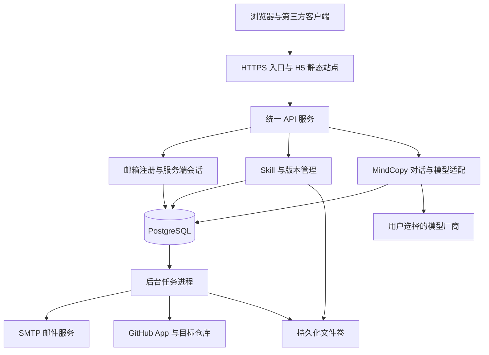

# DreamFly 公共 Mind Skill 平台实现计划

实施进度（2026-09-25）：本地平台已实现并通过前后端构建与 18 项针对性检查；按用户要求暂缓远程服务器 Docker 部署。详见 [实施状态与验证记录](IMPLEMENTATION_STATUS.md) 和 [本地运行说明](LOCAL_DEVELOPMENT.md)。下文保留原计划，实际已验证范围以实施记录为准。

目标代码库：项目根目录 `D:\gitstore\dreamfly`，SuperBan01/MindUploading-L1-Dreamfly-Mind-Engine。

2026-09-25 目录调整：原仓库子目录已整体迁至项目根目录，Git 历史和未提交改动保留；计划与依赖说明统一放入 `docs/`。下文相对路径均相对于项目根目录。

## 1. 目标、已确认要求与范围

在现有 DreamFly 前端基础上建立公共平台，让用户创建、上传、校验、管理和发布自己的意识 Skill，通过统一接口与 MindCopy 交互，并将发布版本自动同步到 GitHub。

本计划整合前一版全部平台功能，并以以下要求替代前一版中的可选假设：

1. 邮箱验证码用于确认邮箱归属并完成注册；日常登录使用邮箱和密码；登录状态由服务端会话管理。
2. PostgreSQL 保存用户、会话、Skill、版本、模型配置、消息与任务等业务数据。
3. 生产环境部署在远程 Linux 服务器，通过 Docker Compose 管理应用、数据库和后台任务等组件。
4. 用户可以自行配置不同厂商的 API Key、模型和连接档案。
5. 保留并完成统一 Skill 格式、旧 `.mind` 迁移、公共目录、个人空间、独立交互会话、GitHub 自动同步、权限控制、运行状态与部署文档。

### 1.1 产品定义

- **意识 Skill**：人格指令、表达方式、价值观、记忆与素材组成的可版本化内容包。
- **MindCopy**：加载某个 Skill 发布版本后创建的交互实例。
- **账号会话 auth session**：登录凭据在服务端的状态记录。
- **对话会话 conversation**：访问者与指定 Skill 版本之间的消息历史。与账号会话分表管理。
- **模型连接 profile**：用户自己的厂商、协议、地址、API Key 与默认模型配置。

首期完成 H5 公共平台与一对一文本交互。现有录音、图片采集保留为素材管理；真实语音合成、音色克隆、多 MindCopy 群聊、MCP/A2A、微调、向量知识库与其他终端适配列入第 15 节后续路线。

## 2. 现有代码事实与修复清单

上一轮已核验目标仓库提交 `408227c16e79bd0f9cf49214ce08f98149e0b432`。技术栈为 UniApp、Vue 3、Vite；没有发现完整后端或数据库实现。README 中的微调流水线、schema 等目录与真实目录不一致。

| 现有模块 | 可复用部分 | 需要改造 |
| --- | --- | --- |
| `src/pages/upload/minddata.vue` | 个人信息、人格与经历采集 | 保存服务端草稿，替代仅靠 globalData 传递 |
| `src/pages/upload/voicedata.vue`、`imagedata.vue` | 录音、图片和身体信息采集 | 文件持久化、权限和资源引用；录音失败不丢失文本草稿 |
| `src/pages/upload/complete.vue` | `.mind` 内容组装和下载界面 | 使用共享格式模块，移除写死的 localhost 后端地址 |
| `src/pages/welcome/explore.vue` | 文件选择、拖入、角色入口 | 接入公共目录、上传校验与迁移预览 |
| `src/pages/consciousness/interaction/index.vue` | 终端交互和流式显示 | 统一 API、独立会话、服务端模型调用及记忆组装 |
| 控制台、memory、assets 页面 | 页面结构和交互样式 | 用数据库真实数据替换静态指标与模拟同步 |
| `.github/workflows/node.js.yml` | CI 入口 | 使用实际存在的 H5 构建命令和新增模块对应检查 |

实施前已知问题：

1. 登录、注册、turing 路由和 past/now/future tab 页面缺失；控制台 knowledge/personality/social 导入缺失。
2. 11 个 `.mind` 样例中有 3 个非法转义；`mind` 与 `mind_id` 字段并存；纯 JSON 与 `export default` 外壳混用。
3. 所有聊天输入被整体转为小写，应只归一化命令关键词。
4. SSE 逐个网络分片解析，缺少连续 UTF-8 解码和事件缓冲。
5. 切换角色未明确清空历史，直接进入交互页还可能读取未初始化的 globalData。
6. 保存依赖仓库外的 localhost 后端，失败会阻塞本地下载；“生成中”进度主要由计时器模拟。
7. 格式声明文档出现疑似 API 凭据；维护者需要检查并撤销有效凭据，代码与文档移除明文。
8. “意识等级”“神经连接”等缺乏测量来源；改用真实发布状态、消息数量、模型与用量信息。

## 3. 总体架构与代码组织

保留现有前端，新增模块化 Node.js/TypeScript 后端。建议 Fastify 作为 HTTP 框架，PostgreSQL 作为持久化数据库，使用迁移脚本维护表结构。一个 API 进程与一个 worker 进程足以支撑首期，不先拆微服务或引入 Redis。



建议增量目录：

```text
dreamfly/                       # 工作区、Git 与 Compose 根目录
├── .git/
├── .github/
├── environment.yml             # Conda 开发工具环境
├── package.json                # 现有前端依赖
├── src/                         # 保留 UniApp 前端
│   ├── services/                # API、登录状态、流式传输
│   └── pages/                  # auth、skills、settings、interaction 等
├── packages/
│   └── mind-format/            # Schema、解析、校验、迁移和导出
├── server/
│   ├── src/modules/
│   │   ├── auth/               # 邮箱验证码、密码、账号会话
│   │   ├── skills/             # 草稿、发布、版本、目录、资源
│   │   ├── providers/          # 用户模型连接及协议适配器
│   │   ├── conversations/      # 消息、上下文和流式交互
│   │   ├── github/             # 安装授权、目标绑定、同步
│   │   └── jobs/               # 数据库任务与 worker
│   └── migrations/
├── deploy/                     # 容器构建与反向代理配置
├── compose.yaml
├── compose.dev.yaml
├── .env.example                # 仅非敏感配置和占位说明
└── docs/                       # API、格式、部署、运维与用户说明
```

架构原则：Skill 内容不携带运行凭据；模型连接属于调用者；对话历史属于访问者；GitHub 是分发渠道，PostgreSQL 和文件存储是在线数据源。

## 4. 身份确认：邮箱验证码注册、邮箱密码登录、服务端会话

### 4.1 注册与邮件发送

注册表单包含邮箱、验证码、密码、确认密码和显示名称。流程为：

```text
输入邮箱 → 请求注册验证码 → SMTP 发送 → 提交邮箱/验证码/密码
         → 服务端原子校验并消费验证码 → 创建已验证用户 → 邮箱密码登录
```

- 邮箱按平台统一规则去除首尾空格、大小写归一化并建立唯一约束。
- 验证码建议 6 位随机数字、10 分钟有效、60 秒重发间隔、单挑战最多 5 次错误尝试。
- 验证码绑定 `challenge_id + email + purpose`，注册与密码重置不能混用。重发使旧挑战失效。
- 验证码使用带服务端密钥的摘要保存，避免数据库泄漏后低成本枚举短码；发邮件任务中需要的原码短期加密，发送或过期后删除。
- 同一邮箱和 IP 分别限流；多 worker 共享 PostgreSQL 中的计数与挑战状态，错误尝试累加不能因事务回滚而丢失。
- 用户创建与验证码消费在同一事务完成，依靠邮箱唯一约束处理并发注册。
- 邮件发送通过事务内创建的任务异步执行；页面区分“已受理”和“发送失败”。任务重试复用同一个仍有效的挑战，不另外生成用户未知的新码。
- SMTP 返回成功只表示服务商接受发送；发送前检查挑战是否仍有效，避免把已失效的排队验证码继续发送。
- 已注册邮箱的验证码请求不泄露账号状态，返回一致的受理提示；具体下一步可在邮件中引导。
- 使用外部事务邮件 SMTP，不在首期自建邮件服务器。配置发件域名、发件地址、SMTP TLS 与投递所需 DNS。

### 4.2 密码与账号恢复

- 登录输入邮箱与密码；未注册、错误密码及不可用账号返回统一失败提示。
- 密码使用成熟库的 Argon2id 保存，参数在服务器上校准；禁止明文或可逆加密密码。这是针对密码泄漏的必要措施，不新增 Skill 内容 Hash 机制。[密码存储依据](https://cheatsheetseries.owasp.org/cheatsheets/Password_Storage_Cheat_Sheet.html)
- 密码要求 8–128 位，包含英文字母和数字，不要求大小写混合或特殊符号，不静默截断；登录按邮箱和 IP 限流。
- 提供邮箱验证码重置密码。验证后只执行重置，不把验证码当作日常登录方式。
- 密码修改、重置、账号停用时撤销该用户全部账号会话；用户随后重新登录。
- 显示名称可修改；首期不开放直接修改登录邮箱，后续增加双邮箱验证流程。

### 4.3 服务端会话

- 登录成功后生成高熵随机不透明 Session ID，服务端将其摘要、user_id、创建时间、最近访问、到期时间和撤销状态写入 `auth_sessions`。
- 浏览器仅持有 Cookie：`__Host-dreamfly_session`，设置 `HttpOnly`、`Secure`、`SameSite=Lax`、`Path=/`，不设置 Domain。
- 每次受保护请求都查服务端会话，并检查用户状态与资源权限；不以浏览器传入的 user_id 确认身份，不使用浏览器自存 JWT 作为登录状态。
- 建议闲置 24 小时、绝对 7 天到期；活动续期不突破绝对期限。登录或身份权限变化后更换 Session ID。
- 退出登录立即撤销数据库会话并清除 Cookie；提供“退出所有设备”。数据库会话使应用重启后登录仍可恢复。
- 状态变更接口使用与会话绑定的 CSRF Token 并检查 Origin；登录/注册等前置接口也检查允许的 Origin。生产前后端同域，不开放带凭据的通配 CORS。
- 第三方服务可按同一登录接口维护 Cookie jar，并取得 CSRF Token 调用 API；独立开发者令牌属于后续扩展，首期统一使用服务端会话。
- 公开目录和公开元数据允许匿名读；上传、交互、下载受限包、模型配置、GitHub 绑定必须登录。

会话 Cookie 和服务端失效设计参考 [OWASP Session Management](https://cheatsheetseries.owasp.org/cheatsheets/Session_Management_Cheat_Sheet.html)。重置码的单次使用、过期及用途隔离参考 [OWASP Forgot Password](https://cheatsheetseries.owasp.org/cheatsheets/Forgot_Password_Cheat_Sheet.html)。

## 5. PostgreSQL 数据模型与文件持久化

PostgreSQL 保存全部结构化业务数据。图片、音频、原始 ZIP 等二进制文件首期存远程服务器 Docker 持久化文件卷，数据库保存资源标识、归属、媒体类型、大小和路径；避免把大文件 Base64 长期塞进 JSONB。后续可用相同资源接口迁移至对象存储。

| 表 | 核心字段与用途 |
| --- | --- |
| `users` | id、email_normalized、password_digest、email_verified_at、display_name、role、status |
| `email_challenges` | id、email、purpose、code_digest、expires_at、attempts、consumed_at、发送状态 |
| `auth_sessions` | session_digest、user_id、created_at、last_seen_at、expires_at、absolute_expires_at、revoked_at |
| `auth_rate_limits` | 邮箱/IP 操作窗口与计数，支持验证码和登录的共享限流 |
| `skills` | id、owner_id、slug、展示信息、草稿内容 JSONB、发布版本引用、可见范围、上下架状态 |
| `skill_versions` | id、skill_id、version、schema_version、规范化内容 JSONB、created_at |
| `skill_publications` | version_id、公开交互范围、下载/导出范围、授权记录、发布时间 |
| `assets`、`skill_version_assets` | 文件归属与状态；版本对素材的引用关系 |
| `model_profiles` | id、user_id、name、provider、protocol、base_url、model、参数 JSONB、密文凭据及 key_version、验证状态 |
| `user_preferences` | user_id、默认 profile_id、界面设置 |
| `conversations` | id、user_id、skill_version_id、title、model_profile_id、非敏感模型配置快照、状态 |
| `messages` | id、conversation_id、序号、role、content、status、client_request_id、模型与 usage 信息 |
| `github_connections` | 用户与安装授权关系、installation_id、GitHub 用户标识、可用状态 |
| `github_targets` | skill_id、connection_id、repo_id、分支、目录、提交/PR 模式、启用状态 |
| `jobs` | type、payload、status、attempts、run_after、lease_until、last_error、业务唯一键 |
| `sync_jobs` | 发布/版本/目标引用、job_id、commit_url、pr_url、同步状态 |
| `usage_records` | user_id、conversation_id、profile_id、厂商、模型、tokens、延迟、结果 |
| `admin_events` | 下架、停用及必要管理操作记录；不记录密钥和完整聊天正文 |

约束与一致性：

1. 邮箱唯一；`owner_id + slug` 唯一；`skill_id + version` 唯一；发布记录与同步任务同事务写入。
2. 服务端将会话用户传入每次私有资源查询。模型连接、对话、草稿和资源均按 user_id/owner_id 隔离，管理权限不自动包含读取 API Key。
3. Skill 规范内容用 JSONB 保留扩展性；权限、状态、引用和排序字段独立成列。接口保存前先执行 Schema 校验。
4. 消息的 `conversation_id + client_request_id` 唯一，防止客户端重发产生重复消息；同一对话同一时间只运行一次生成。
5. 文件先写临时位置、校验后再建立有效引用；未引用文件由任务清理。发布版本引用的文件不能被草稿删除操作破坏。
6. 用迁移脚本升级表结构，业务请求不自动建表；新增索引针对目录分页、用户资源、消息排序和待执行任务查询。
7. Worker 使用事务领取和租约续期处理任务，崩溃后回收过期租约；长网络请求不占着数据库事务。

## 6. 多厂商 API：LifeContextOS 参考与平台实现

### 6.1 已核验的参考实现

参考仓库：EverlastingAI-Official/LifeContextOS。2026-09-25 读取到提交 `888eb354586f09fe63b17dbfb1aab1b90b5d4f05`，提交日期 2026-09-22。本节依据实际代码，而非仅依据 README。

| 参考代码 | 已观察到的实现 | DreamFly 采用方式 |
| --- | --- | --- |
| [cloud_llm.py](https://github.com/EverlastingAI-Official/LifeContextOS/blob/888eb354586f09fe63b17dbfb1aab1b90b5d4f05/apps/api/lifecontext_api/cloud_llm.py) | 厂商预设、三种协议、模型目录、连接校验、任务配置快照 | 按厂商与协议分层实现 TypeScript 适配器 |
| [cloud_connections.py](https://github.com/EverlastingAI-Official/LifeContextOS/blob/888eb354586f09fe63b17dbfb1aab1b90b5d4f05/apps/api/lifecontext_api/cloud_connections.py) | 保存多连接档案，凭据使用 Windows DPAPI 加密 | 借鉴档案结构；存储改为 PostgreSQL 与服务端密钥管理 |
| [CloudModelPanel.vue](https://github.com/EverlastingAI-Official/LifeContextOS/blob/888eb354586f09fe63b17dbfb1aab1b90b5d4f05/frontend/src/components/CloudModelPanel.vue) | 厂商选择、加载模型、保存和切换档案、keep/replace/clear 密钥操作 | 在现有 UniApp 中实现对应设置页 |
| [main.py 的 cloud-model 接口](https://github.com/EverlastingAI-Official/LifeContextOS/blob/888eb354586f09fe63b17dbfb1aab1b90b5d4f05/apps/api/lifecontext_api/main.py#L1980) | providers、models、config、profiles 等接口 | 改为用户隔离的 `/api/v1/model-profiles` 接口 |

参考代码的厂商预设包含 OpenAI、DeepSeek、OpenRouter、Anthropic、Gemini、CC Switch；预设 Base URL 由后端固定，前端显示为只读。其全局当前连接、本地文件和 Windows DPAPI 不直接适合远程多用户 Linux 服务；也不能把服务器的 `127.0.0.1` 当作访问者电脑上的 CC Switch。此处借鉴交互和架构，不直接照搬桌面部署逻辑。

### 6.2 首期支持矩阵

| 厂商/入口 | 协议 | 范围 |
| --- | --- | --- |
| OpenAI、DeepSeek、OpenRouter、SiliconFlow | OpenAI Chat Completions 兼容协议 | 文本、流式输出、模型目录或手填模型 |
| Anthropic | Messages | 系统提示词、消息、错误和流式事件转换 |
| Google Gemini | generateContent | 系统指令、消息角色、流式响应和用量转换 |
| 自定义兼容服务 | 用户选择上述支持协议及公开 HTTPS 地址 | 同等身份校验、连通性校验与出口地址限制 |

厂商名称不等同于协议，不能只更换 URL 就假定所有 API 兼容。模型 ID 不写死在 Skill 内；接口返回的模型列表与手动输入共同支持，无法列模型时仍可测试指定模型。

### 6.3 用户设置与交互规则

1. 用户新增连接档案，填写名称、厂商、API Key、模型、超时和输出长度；自定义入口额外填写地址和协议。
2. 档案可保存为“未验证”；用户选择“测试连接”时发送最小测试请求，页面提示可能产生少量模型用量。
3. 验证失败保留原有有效默认连接，显示鉴权失败、模型不可用、协议不匹配、限流或超时等可操作原因。
4. 支持新增、编辑、删除、清除密钥、设为默认和模型列表刷新。凭据字段用 `keep / replace / clear` 区分空输入与真正删除。
5. 与公开 Skill 交互默认使用**访问者自己的连接**，不使用 Skill 作者的密钥。平台演示额度如开启，必须明确展示来源与额度。
6. 建立会话时记录 profile_id、厂商、地址、模型和参数快照。修改默认连接只影响新会话；旧会话显式切换才改变其后续请求。
7. 密钥可以在同一连接内轮换；厂商/地址发生变更时清除原凭据并要求重新验证，禁止把旧厂商 Key 发到新地址。
8. 删除/禁用连接会使依赖该连接的新请求失败并提示重新选择，不能悄悄切换到平台 Key 或其他用户连接。运行中的请求使用开始时配置。
9. 密钥列表接口只返回 `api_key_configured` 和脱敏提示，不回显明文；密钥不进入日志、Skill 导出、GitHub 或浏览器持久化存储。
10. 云端交互页面说明将把当前会话的人格与获准使用的记忆发给所选厂商；保存该连接的用户确认状态。更换目的地址后重新确认。

### 6.4 凭据和自定义入口

- API Key 用成熟密码库的认证加密（如 AES-256-GCM）保存，随机 nonce，密文绑定 user_id 与 profile_id；数据库记录密钥版本。
- 主密钥通过 Compose secret 文件提供，不写入 Git、数据库或镜像。密钥轮换保留必要旧版本直到完成重加密，并单独备份恢复材料。
- 自定义入口会让服务器代用户请求任意地址，存在访问内部 PostgreSQL、管理接口或云元数据的具体风险。因此仅支持公开 HTTPS 地址，拒绝内网、回环、链路本地、IPv6 对应范围、URL 内凭据和不允许的端口；默认不跟随重定向。
- 校验必须约束实际连接目标，不能只在保存时解析 DNS：每次请求解析并验证全部地址，连接绑定已验证地址且保留正确 TLS 主机名，防止 DNS 重绑定绕过。模型目录与连接测试复用同一出口策略。
- 私有代理部署需管理员显式配置单独入口，不开放用户任意访问内网。首期不承诺连接用户电脑上的本地代理。[SSRF 设计依据](https://cheatsheetseries.owasp.org/cheatsheets/Server_Side_Request_Forgery_Prevention_Cheat_Sheet.html)

### 6.5 协议适配器

统一内部能力为 `listModels`、`testConnection`、`chat`、`streamChat`；输入使用平台消息与参数结构，输出统一成文本增量、完成原因、usage 和错误。适配器负责鉴权头、路径、system 消息、模型参数与 SSE 差异；不把厂商响应直接交给前端。

不支持的参数在保存或请求前返回明确错误；上游未返回 usage 时记录“未知”，不能按流分片数量伪造 token 数。首期只保证文本链路，结构化提取等能力按后续实际需要扩展。

## 7. 统一 Skill 格式与旧数据迁移

### 7.1 包结构和数据模型

采用可交换的 `SKILL.md` 与结构化 `mind.json`：

```text
example-mind/
├── SKILL.md
├── mind.json
└── assets/
    ├── avatar.png
    └── voice-sample.wav         # 可选素材，不代表已具备语音能力
```

`SKILL.md` 使用 YAML frontmatter 加 Markdown 正文，frontmatter 至少包含 name、description；name 等于包目录名和 mind.json.slug。平台扩展不改变通用封装，也不宣称普通 Skill 客户端自动具备 MindCopy 运行能力。[Agent Skills 规范](https://agentskills.io/specification)

建议 `mind.json` 示例：

```json
{
  "schema_version": "1.0",
  "slug": "example-mind",
  "version": "1.0.0",
  "name": "示例数字分身",
  "description": "用于交流个人经历和思考方式",
  "language": "zh-CN",
  "persona": {
    "instructions": "表达直接，先解释判断依据，再给建议。",
    "self_description": "我喜欢研究技术与人的关系。",
    "values": ["诚实", "好奇"]
  },
  "memory": {
    "fragments": [
      {"id": "memory-1", "time": "2025", "content": "开始学习软件开发。"}
    ]
  },
  "assets": {"avatar": "assets/avatar.png"},
  "capabilities": ["text-chat"]
}
```

平台独立生成 skill_id 和 owner_id；包里的作者文字、原 mind_id 或用户自填 ID 不能用于授予所有权。schema_version 为格式版本，version 为内容版本。

### 7.2 解析与校验

- `packages/mind-format` 提供纯函数解析、JSON Schema 校验、迁移和导出，前后端共用；服务端负责最终验证。
- 新单文件 `.mind` 为 UTF-8 纯 JSON；多文件上传使用 ZIP。仅有 SKILL.md 时映射为人格草稿，记忆与素材可空。
- 数据库中的规范内容为编辑源，导出时生成 SKILL.md。导入包的两份人格描述不一致时返回冲突预览，用户选择后统一保存。
- 记忆首期放在 `memory.fragments`；未来使用 references 外置时必须有资源引用规则，不重复维护两份记忆。
- 校验字段类型、必填项、长度、能力枚举、版本格式与相对资源路径。错误包含 `path / code / message`，如 `/persona/instructions` 不能为空。
- 建议普通 JSON 最大 10 MiB，ZIP 最大 50 MiB、解压总量最大 100 MiB、最多 100 个文件；上线前按资源预算调整。明确限制并在上传前展示。
- 拒绝 ZIP 越界路径、绝对路径、符号链接、加密包；禁止执行包内脚本；Markdown 展示禁用原始 HTML 或按允许列表净化。
- 头像首期只接受受支持的栅格格式；私有素材通过鉴权下载，不能暴露为可猜路径。包内任意 URL 不自动抓取。

### 7.3 旧格式迁移

| 旧字段/形式 | 新处理 |
| --- | --- |
| `metadata.personality_prompt` | `persona.instructions` |
| `memory.self_cognition` | `persona.self_description` |
| `memory.memory_fragments` | `memory.fragments` |
| `metadata.name`、occupation 等 | 显示信息与可选资料字段 |
| `voice_prompt`、`image_data` Base64 | 有效素材拆分为文件；占位字符串作为缺失素材 |
| BCE 出生日期 | 保留原显示值，可计算日期允许为空 |
| `status`、`consciousness` | 兼容扩展/迁移说明，不作为实时测量指标 |
| `mind_id` 或 `mind` | 保留来源标记，不用作权限或新内容标识机制 |
| `export default { ... }` | 只剥离明确的数据外壳后 JSON 解析，禁止 eval |

非法转义不静默猜测修复；对仓库内 3 个已知失败样例分别修正并记录原因，外来文件展示定位错误。验收覆盖“旧包迁移→导出→再导入”后人格、记忆及素材引用一致。

## 8. 公共平台、发布权限和素材管理

### 8.1 用户页面

| 页面 | 功能 |
| --- | --- |
| 注册/登录/找回密码 | 邮箱验证码注册、密码登录、密码重置 |
| 公共目录 | 分页、名称/描述/标签搜索、角色卡片 |
| Skill 详情 | 介绍、作者显示信息、版本、支持能力、交互/下载入口 |
| 我的 Skills | 草稿、发布、下架、版本记录、同步状态 |
| 上传与编辑 | 表单创建、拖入文件、迁移预览、错误定位、人格与记忆编辑 |
| 素材与记忆 | 图片、音频与记忆片段管理；展示实际资源和引用 |
| 发布预览 | 展示公开字段、公开交互记忆、导出文件及目标仓库 |
| MindCopy 对话 | 会话列表、新建/切换/重命名/删除、模型选择、历史与流式消息 |
| 模型设置 | 多连接档案、模型列表、测试、默认连接和密钥管理 |
| GitHub 设置 | 安装绑定、仓库/分支选择、同步模式、失败重试 |
| 账号设置 | 当前身份、修改密码、退出当前或全部设备 |
| 简单管理页 | 管理员下架公开内容、停用违规账号、查看任务错误 |

### 8.2 发布与授权

默认私有草稿；发布创建指定版本与发布记录。分别设置目录可见、允许公开交互、允许包下载、GitHub 导出范围，不能用一个 public 标志同时授予所有能力。

- 对话运行只加载访问者可用的内容。作者私有记忆不能先交给模型再要求模型保密。
- 私有素材不是公开卡片的隐式附件；导出使用明确资源列表，并校验引用仍完整。
- 发布内容修改生成新版本；已有会话保留原版本，切换到新版本需要显式操作。
- 下架、撤销访问与管理员停用是当前权限，不能因为旧会话保存版本引用就绕过。每次生成、读取或导出均重新校验；下架后可保留访问者本人既有聊天记录，但停止继续生成。
- 访客会话只属于访客，不自动成为作者或全体用户的长期记忆；用户主动保存为个人记忆必须经过确认。
- 展示许可/使用范围说明；GitHub 发布会实际分发对应内容，不能承诺平台下架后自动撤回第三方副本。

## 9. MindCopy 统一交互服务

运行步骤：

1. 根据账号会话确认访问者，检查 Skill 当前可访问性。
2. 创建或读取 conversation，选定 Skill 版本与访问者有权使用的模型连接。
3. 组装平台规则、人格、获准使用的记忆片段、会话历史和用户原文。
4. 按模型上下文与输出预算选择记忆和历史。首期使用关键词/全文检索，中文采用显式分词或关键词回退；不假定 PostgreSQL 默认全文配置适合中文。
5. 服务端调用协议适配器，统一转换为流式事件。
6. 持久化用户消息、助手文本、状态、厂商/模型与实际 usage；失败或取消保留可识别的部分结果。

建议流事件为 `message.start`、`message.delta`、`message.completed`、`message.failed`、`message.cancelled`。前端通过携带会话 Cookie 的 POST fetch 流读取；后端连续解码并按完整 SSE 事件处理，支持中文跨分片和事件跨行。

生命周期：

- 开始生成时记录 client_request_id；相同请求重发返回已存在状态，避免再次计费。
- 取消按钮通过独立接口终止对应生成，并向上游传递取消信号；网络断开默认取消，页面重连后从历史查询最终状态。
- 已开始输出后不自动重试整次模型请求；否则可能重复计费和重复内容。用户可显式重新生成，保留尝试记录。
- 服务重启后把无运行进程的 generating 消息标为 interrupted；不能无限显示生成中。
- 账号额度、并发数、超时与上下文上限均在服务端执行；BYOK 也受平台并发限制。平台展示 token 用量，费用未知时不伪造金额。
- 模型超时、401/403、429、无文本终止和协议错误统一返回机器码与可读说明，不暴露完整上游响应或凭据。

## 10. GitHub 自动同步

### 10.1 授权与目标

采用 GitHub App，申请目标仓库 Contents 写权限；PR 模式另需 Pull requests 写权限。平台的邮箱账号仍是登录身份，GitHub 仅作发布连接，不替代邮箱注册和会话鉴权。[GitHub Apps 说明](https://docs.github.com/en/apps/creating-github-apps/about-creating-github-apps/about-creating-github-apps)

支持平台独立内容仓库和用户自有仓库。绑定回调使用服务端保存的一次性 state 对应当前已登录用户，并核验该用户可访问的安装与仓库；客户端提供 installation_id 本身不构成授权。

保存 repo_id、分支和平台生成的目录前缀；普通用户不能借平台 App 向任意仓库目录写入。仓库私有性、安装权限和目标状态在同步前重新检查；公开仓库仅允许明确获准公开导出的文件。

### 10.2 发布流程与一致性

```text
用户确认导出范围 → 发布版本与同步任务同事务入库
                → Worker 领取 → 生成标准包
                → 写入 blobs/tree/commit → 非强制更新分支
                → 回写 commit 链接与同步结果
```

- 每个版本一次提交，示例目录为 `skills/{owner_id}/{skill_id}/{version}/{slug}/`；最末层目录名满足 SKILL.md 的 name 规则。
- 通过 Git 数据 API 将该版本文件组成一棵 tree 和一个 commit；保留仓库其他文件，不做强制覆盖。[Git commits API](https://docs.github.com/en/rest/git/commits)、[Git references API](https://docs.github.com/en/rest/git/refs)
- 受保护分支走分支/PR。PR 创建成功显示 `awaiting_merge`，不能显示“目标分支已同步”；通过已校验签名的 webhook 或定期查询更新合并/关闭状态。
- 使用“发布记录 + 目标仓库/分支/目录”的任务唯一键；对同一目标分支串行提交。GitHub 原生 commit 标识照常使用，不额外引入内容 Hash 系统。
- 发布时保存目标配置快照。修改目标只影响后续任务；重新同步旧版本到新目标必须显式发起。
- 分支被其他提交更新时，读取新 head、重新构造提交并有限重试；空仓库走受支持的初始提交流程。
- 超时后无法确定远端结果时，先核对任务对应发布标记、路径与提交记录，再决定重试，防止成功提交被重复创建。
- 临时网络错误/限流按退避与服务商提示重试；授权撤销、仓库删除、权限不足标记需用户处理。
- 平台发布与 GitHub 同步独立展示。同步失败不撤销平台发布，也不阻止用户在平台内交互。
- 第一期单向同步；GitHub 手工修改通过显式导入产生新草稿，不自动覆盖平台版本。

## 11. API 清单与统一行为

前缀统一为 `/api/v1`，通过 OpenAPI 描述请求、响应、鉴权和错误。下表中的“本人”意味着服务端会话鉴权与资源归属检查。

| 方法与路径 | 用途 | 权限 |
| --- | --- | --- |
| `POST /auth/email-codes` | 请求 register/reset_password 验证码 | 匿名，限流与 Origin 检查 |
| `POST /auth/register` | 验证码注册 | 匿名，单次验证码 |
| `POST /auth/login` | 邮箱密码登录，写入 Cookie | 匿名，限流与 Origin 检查 |
| `GET /auth/me` | 当前身份与 CSRF Token | 本人 |
| `POST /auth/logout`、`/auth/logout-all` | 退出当前/所有账号会话 | 本人 |
| `POST /auth/reset-password` | 验证码重置密码 | 匿名，单次验证码 |
| `POST /auth/change-password` | 校验旧密码后修改 | 本人 |
| `GET /model-providers` | 厂商、协议及预设目录 | 本人 |
| `GET/POST /model-profiles` | 列表、新建配置 | 本人 |
| `PATCH/DELETE /model-profiles/{id}` | 更新、删除配置 | 本人 |
| `POST /model-profiles/{id}/test` | 最小请求验证连接 | 本人 |
| `POST /model-profiles/{id}/models` | 服务端加载模型列表 | 本人 |
| `PUT /users/me/default-model-profile` | 选择默认连接 | 本人 |
| `POST /skills/validate` | 校验与迁移预览 | 本人 |
| `POST /skills` | 文件/表单创建草稿 | 本人 |
| `PATCH /skills/{id}` | 编辑草稿及展示信息 | 作者 |
| `GET /skills` | 公开搜索分页或 scope=mine | 公开/本人 |
| `GET /skills/{id}` | 权限裁剪后的详情与版本信息 | 公开/授权访问者 |
| `POST /skills/{id}/versions` | 保存新版本 | 作者 |
| `POST /skills/{id}/publish`、`/unpublish` | 发布/下架 | 作者 |
| `GET /skills/{id}/export?version=...` | 标准包下载 | 有下载权限者 |
| `POST /assets`、`GET/DELETE /assets/{id}` | 素材上传、读取、删除 | 按素材/版本权限 |
| `POST /mindcopies/{skill_id}/sessions` | 创建 conversation | 登录且可交互 |
| `GET /conversations` | 我的会话列表 | 本人 |
| `PATCH/DELETE /conversations/{id}` | 重命名或删除会话 | 本人 |
| `PUT /conversations/{id}/model-profile` | 显式切换后续消息模型 | 本人 |
| `GET/POST /conversations/{id}/messages` | 历史/流式生成 | 本人且具备相应访问权 |
| `POST /conversations/{id}/messages/{message_id}/cancel` | 取消本人生成 | 本人 |
| `POST /github/connect` | 生成安装/授权地址与 state | 本人 |
| `GET /github/callback` | 完成安装绑定 | 当前会话及一次性 state |
| `GET /github/repositories` | 可绑定仓库 | 本人 |
| `DELETE /github/connections/{id}` | 解绑、停止后续同步 | 本人 |
| `PUT /skills/{id}/github-target` | 配置目标 | 作者且可访问仓库 |
| `GET /sync-jobs`、`GET /sync-jobs/{id}` | 同步列表与详情 | 本人 |
| `POST /sync-jobs/{id}/retry` | 重试 | 本人 |
| `POST /github/webhook` | 安装撤销、PR 状态更新 | 校验 GitHub 签名 |
| `POST /admin/skills/{id}/unpublish` | 管理下架 | 管理员 |
| `PATCH /admin/users/{id}/status` | 停用/恢复账号 | 管理员 |

说明：对话资源统一使用 conversations 命名，避免与 auth_sessions 混淆；创建入口保留 MindCopy 的产品语义。API 版本只是可演进接口的版本号，不新增冻结 Contract 流程。

普通响应统一包含 data、request_id；失败响应包含 error.code、message 和必要字段错误。鉴权失败用 401、无权限用 403 或按资源策略使用 404、内容冲突用 409、格式错误用 422、限流用 429。SSE 已开始后用失败事件报告错误。

## 12. 远程服务器与 Docker Compose 部署

### 12.1 拓扑与组件

默认单台远程 Linux 服务器部署应用和 PostgreSQL，浏览器通过 HTTPS 访问；数据库位于服务器内网容器网络，开发者通过 SSH 隧道或运维命令访问，不向公网开放 5432。

| Compose 服务 | 责任 | 持久化/网络 |
| --- | --- | --- |
| `web` | Nginx：H5 静态站点、TLS、反向代理与 SSE 转发 | 对外 80/443；证书只读挂载 |
| `api` | Node.js API、会话验证、上传、模型请求 | 内部端口；连接 db；挂载 assets 卷 |
| `worker` | 邮件、GitHub 同步、过期清理与恢复任务 | 与 api 使用同一后端镜像、不同启动命令；挂载必要文件卷 |
| `db` | PostgreSQL | 专用数据卷；不映射公网端口 |
| `migrate` | 一次性数据库迁移 | 完成后退出；应用启动前执行 |
| `backup` | 数据库与资源备份、保留期管理 | 运维 profile 下运行，由服务器调度定期启动 |

外部依赖为 SMTP、GitHub API 和模型厂商；首期不需要额外 Redis、向量库或本地大模型容器。远程服务器初步按 2–4 vCPU、4–8 GB 内存估算，实际容量根据并发和附件规模调整；不包含本地推理/GPU。

### 12.2 容器与网络设置

- 分别构建 H5 静态镜像和后端镜像；使用明确版本标签、依赖锁文件与多阶段构建，生产镜像不包含密钥或本地数据。
- web→api、api/worker→db 通过 Compose 服务名访问；浏览器统一调用相对路径 `/api/v1`，彻底移除 localhost:3001。
- 设置 db `pg_isready` 健康检查，迁移依赖数据库就绪；api/worker 依赖迁移成功。健康检查用于实际启动顺序，不等于新增 Smoke test 或发布 Gate。[Compose 启动顺序](https://docs.docker.com/compose/how-tos/startup-order/)
- 应用配置数据库连接重建；数据库运行中重启后应恢复，而不能只依赖启动检查。
- SSE 代理关闭响应缓冲，配置合理读取超时；后端按需发送保活事件，客户端可取消。
- 设置上传体积、请求超时、容器重启策略、日志轮转和非 root 运行用户；api/worker 共享素材卷的 UID/GID 保持一致。
- TLS 证书由部署流程申请与续期，并在续期后重载 Nginx。生产域名和会话 Cookie 同域。

### 12.3 配置与密钥

非敏感配置建议包括 APP_ORIGIN、数据库地址/库名、SMTP_HOST/PORT/FROM、验证码期限、会话期限、上传限制、厂商目录和 GitHub App ID。

敏感配置包括数据库密码、SMTP 密码、API Key 加密主密钥、验证码摘要密钥、GitHub App 私钥和 webhook secret。通过 Compose secrets 按服务最小范围挂载，应用实现 `_FILE` 读取；实际 secret 文件保存在服务器受限目录，`.env.example` 只保留占位说明。

Compose secrets 提供文件挂载与服务访问范围，并不会自动加密宿主机上的源文件；宿主机权限及备份加密仍需配置。[Compose secrets 文档](https://docs.docker.com/compose/how-tos/use-secrets/)

### 12.4 上线、升级与恢复

以下是实施阶段需要形成的操作流程，本次未执行：

1. 准备远程服务器、域名、HTTPS、SMTP 发件账户和 GitHub App；创建持久化目录与 secrets。
2. 在开发/CI 环境实际执行 `npm run build:h5`，构建后端镜像，推送或传输带版本标签的镜像。
3. 在服务器验证 Compose 配置；启动 db 并等待健康，执行 migrate，成功后启动 api/worker/web。
4. 配置备份调度，完成一次从空目录/新数据库恢复的演练。
5. 通过真实注册、两账号隔离、模型调用和 GitHub 提交验证完整流程。
6. 升级前备份，先执行兼容迁移再替换应用；应用失败可回退镜像。数据库破坏性迁移单独安排维护窗口，不承诺任意版本无损自动回滚。

备份包括 PostgreSQL 逻辑备份、assets 文件、必要部署配置与独立保护的加密密钥材料。建议每日备份并复制到服务器之外，初期目标 RPO≤24 小时、RTO≤4 小时；演练后确认是否达标。数据库与文件备份使用维护窗口或协调快照，并保留对应资源，避免恢复出的版本引用不存在的文件。[PostgreSQL 逻辑备份](https://www.postgresql.org/docs/current/backup-dump.html)

日志只记录 request_id、任务标识、错误类型和必要性能数据；不记录密码、验证码、Cookie、API Key 或完整提示词。提供数据库空间、任务积压、邮件失败和模型错误的基本运维查看入口。

## 13. 分阶段实施、依赖与交付物

下表按一名熟悉 Vue/Node/PostgreSQL 的全栈开发者估算，不含外部账号审批等待。相较上一版，新增完整邮箱体系、用户自配模型、多协议和容器化部署，因此重新估算。

| 阶段 | 工作与交付物 | 可验收结果 | 估算 |
| --- | --- | --- | --- |
| P0 工程修复与后端骨架 | 修复缺失引用、样例与初始化；后端目录、数据库迁移入口、开发 Compose | H5 构建通过；页面可打开；后端可连接容器数据库 | 2–3 天 |
| P1 账号与会话 | 注册/登录/重置界面；邮件任务；验证码、密码、Session 与 CSRF | 验证码单次有效；登录可持久化；退出/重置立即失效 | 3–4 天 |
| P2 格式模块 | JSON Schema、旧格式迁移、ZIP 解析、标准导出与规范文档 | 现有样例迁移；往返导入导出一致；错误定位明确 | 2–3 天 |
| P3 Skill 平台与存储 | 用户空间、目录、草稿、版本、权限、记忆/素材、发布预览 | 两账号独立管理；公开与私有范围正确；刷新不丢失 | 4–6 天 |
| P4 BYOK 与 MindCopy | 模型档案、三协议、测试/模型列表、密钥加密、独立会话与 SSE | 用户可切换厂商；人格与获准记忆参与对话；历史隔离 | 4–6 天 |
| P5 GitHub 发布 | App 绑定、目标设置、worker 提交、PR 状态、失败恢复 | 发布后自动提交；PR 待合并可区分；重复任务不重复发布 | 3–4 天 |
| P6 远程部署与运维 | 生产 Compose、HTTPS、迁移、备份恢复、日志、管理页 | 远程完整流程可用；重启不丢数据；完成恢复演练 | 3–5 天 |
| P7 验收与文档 | 针对关键失败验证，修复验收问题，用户/API/运维说明 | 第 14 节首期验收全部满足，明确仍未支持能力 | 3–4 天 |

首期合计 **24–35 个工作日**。P2 可在 P0 后独立推进；P3 依赖身份和格式；P4 依赖权限/版本；P5 依赖发布数据；部署骨架从 P0 建立，P6 完成生产落地。估算不构成未运行代码的可靠性保证。

首期最终交付：改造后的前后端源码、数据库迁移、共享格式包与样例、OpenAPI、Dockerfile/Compose/反向代理配置、环境配置样例、GitHub App 配置说明、邮件与会话说明、部署升级/备份恢复手册及验收记录。

## 14. 针对具体失败场景的验收

不为形式新增全量测试、内容 Hash、冻结 Contract、Baseline、Gate 或 Smoke test。只对本项目的真实边界和失败场景编写必要验证，执行受影响模块检查与实际 H5/后端构建。

| 场景 | 通过标准 |
| --- | --- |
| 验证码过期、重放、用途混用、连续错误 | 不创建账号；尝试次数持续累计；重发后旧码失效 |
| 同邮箱并发注册 | 最终只有一个账号，验证码消费与创建一致 |
| 邮件队列失败或延迟 | 可观察失败和重试；过期/失效挑战不继续发送 |
| 登录会话与 CSRF | 错误密码无会话；跨站写入拒绝；退出/重置后旧 Cookie 失效 |
| api/worker/db 重启 | 已发布内容、会话记录保留；过期任务可恢复；中断生成有明确状态 |
| A/B 用户隔离 | B 不能读取 A 私有包、素材、模型连接或会话，不能使用 A API Key |
| 旧样例与坏 ZIP | 已知样例迁移通过；非法路径/超量包被拒绝且不写出资源目录 |
| 标准包往返 | 人格、记忆和素材引用一致；不含账号或运行凭据 |
| 公开角色私有记忆 | 模型请求、导出包与公开详情均不包含未授权内容 |
| 三种模型协议 | 文本/流式正常；认证、超时、限流及错误终止有一致状态 |
| 厂商地址修改与凭据清除 | 原密钥不随地址变更泄露；clear 后依赖连接不可调用 |
| 自定义入口访问内网 | 保存、测试、模型列表和对话均不能绕过实际连接目标限制 |
| 中文跨分片与 SSE 半事件 | 中文与完整事件不丢失；取消后不继续追加成功完成状态 |
| 默认模型和角色切换 | 不影响已接受请求；不同角色与访问者上下文不混用 |
| 重复消息请求 | 相同 client_request_id 不重复生成、写消息或发起模型调用 |
| GitHub 并发更新/远端成功回写失败 | 不覆盖其他提交；恢复不产生重复发布 |
| GitHub 权限撤销和 PR 未合并 | 显示可处理原因或 awaiting_merge，不误报目标分支成功 |
| 发布/下架/撤销访问 | 当前权限立即约束后续交互和导出，旧会话不能绕过 |
| 远程恢复 | 新数据库与文件目录恢复后，账号、版本、消息及资源引用可用；密钥可解密 |

端到端业务验收顺序：注册 → 邮箱密码登录 → 配置自己的 API → 上传旧 `.mind` → 校验迁移 → 保存/编辑 → 预览并发布 → 公共目录可见 → 第二个账号使用自己的 API 交互 → GitHub 自动同步 → 查看提交链接 → 退出后验证会话失效。

对每种协议至少完成一次获授权真实连接验证；自动验证使用脱敏固定响应覆盖分片与错误情形。连接测试与真实验收可能产生模型费用，在实施时使用指定测试账号和额度。

## 15. 后续功能路线与本期边界

“全部功能”覆盖前版承诺的平台主体，同时保留前版已明确后置的路线，不把它们静默删除。它们需要后续独立估算：

| 后续能力 | 依赖与实施方向 |
| --- | --- |
| 语音输入、TTS、音色克隆 | 在现有素材与模型连接上增加音频任务、音色授权、播放和流式音频；服务器/厂商成本独立评估 |
| 多 MindCopy 群聊 | 在独立会话基础上增加多角色调度、上下文归属与调用预算 |
| 向量知识库 | 在已有记忆检索不足时增加 embedding 配置与 PostgreSQL 扩展，明确重建与版本关系 |
| MCP/A2A、开发者令牌 | 增加协议适配、授权范围和可撤销凭据，不直接把网页会话暴露给第三方插件 |
| 模型微调 | 增加训练数据授权、任务、产物与模型部署；不与当前提示词人格建模混淆 |
| 多端适配与本地代理 | 替换浏览器专用录音/文件 API；本地代理需要专门连接方案，不能使用远程服务器 localhost |
| 支付、市场交易、复杂审核 | 当前 assets 仅表示内容和素材；交易、付费与自动审核按实际产品规则另行设计 |

## 16. 实施所需外部配置与默认决策

本文已确定可开始开发的默认设计；以下是上线依赖，不阻止本地编写业务代码：

- 远程 Linux 主机、域名与 HTTPS 证书管理方式；可访问 SMTP、GitHub 及目标模型服务的网络。
- SMTP 发件域名、服务账号和投递配置；开发时使用专用测试邮箱。
- GitHub App 与至少一个用于验证的目标仓库；目标仓库需有实际安装授权。
- 每种模型协议的测试配置；这些凭据由对应测试用户在设置页输入，不写入样例文件。
- PostgreSQL、素材、备份空间及服务器之外的备份目的地。
- API Key 加密密钥等部署 secrets，以及可恢复的独立保管方式。

默认决策：先做 H5；单远程服务器 Compose；PostgreSQL 业务数据加持久化文件卷；匿名浏览、登录交互；每用户自带模型连接；草稿私有；发布触发已配置目标的 GitHub 单向同步。未配置目标时明确显示“未启用同步”，不让用户误以为已推送。

## 17. 参考来源与本次文档生成记录

目标工程分析沿用 2026-09-24 已核验结果；本文件是当前实施主计划，实际完成与验证范围见 [实施记录](IMPLEMENTATION_STATUS.md)。

LifeContextOS 的只读参考副本保存在项目根目录的 `.references/LifeContextOS/`，已由 `.gitignore` 排除；固定参考提交为本文件第 6 节所列版本，不作为 DreamFly 的运行依赖，也未把其代码直接合入目标工程。当前参考提交根目录未见 LICENSE 文件，实施以设计借鉴和独立编写为主；若直接复用代码，需先核实相应授权条款。

编写本计划时查看了参考仓库页面、Git 源码及本文链接的官方/原始资料；当时只新增 Markdown 计划和参考副本，未修改业务代码、发送邮件、使用用户 API Key、创建 GitHub App、推送内容或部署服务器。后续开发环境配置和本次目录迁移另行实施，均未实现计划中的业务功能。

检查工作区时，`rg --files -g AGENTS.md` 未找到额外文件而返回状态 1，属于“无匹配结果”；适用约束使用本对话给定的 AGENTS.md 指令。参考项目 DPAPI 与远程 Linux 不兼容的情况已在第 6 节转为服务端加密设计，无需在 Linux 上模拟 Windows 凭据存储。
